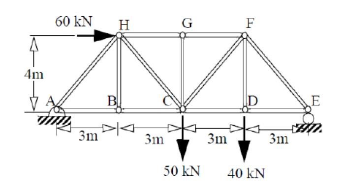
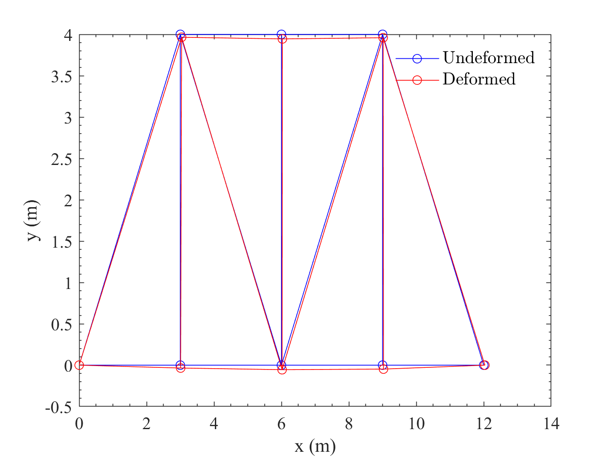

# TrussFEA
The program can do finite element analysis of planar two-nodes truss structures.

To start with, input a txt file to define the geometry, material and boundary conditions of the structure. The solver in the program will output the nodal displacements, counterforces, strain and stress of elements. Also, we can plot the un-deformed and deformed shapes of the structure.

## Tutorial

### Prepare an input file

To solve a truss structure, first prepare an input txt file according to a specific format.

<u><i>Note:</i></u> 

- All input should be in SI units (m, kg, s)
- Suppose each node has two DOFs, namely x and y. The positive directions of x and y are rightward and upward respectively.
- All trusses in the structure use the same material and have a circular cross section, so only the diameter needs to be defined. If more diverse materials and cross sections are desired, just fork the repository and develop by yourself.
- Loads are exerted on nodes. For distributed loads, need to convert them to nodal loads first.

The first line defines the Young's modulus of the material.

The second line defines the diameter of the cross section.

The third line defines the number of nodes (`Nnode`) and elements (`Nelem`).

For the next `Nnode` lines, each line has two numbers to define the x and y coordinates of each node.

Then for the next `Nelem` lines, each line has two numbers $i$ and $j$ to define the element linked by two nodes numbered $i$ and $j$.

After the definition of geometry, boundary conditions and loads.

There is a line containing the number of boundary conditions `Nbc`.

For the next `Nbc` lines, each line has two numbers $i$ and $j$, indicated the $j$ direction (1 for x, 2 for y) of node $i$ is constrained.

Finally, there are `Nnode`$\times 2$ lines to define the loads (since each node has two DOFs).

Here is an example.

The truss structure with cylindrical members with diameter d=20mm combined by pins is shown in the figure below. Young's modulus of the material is E=70GPa.



The input file of the example `input.txt` can be written as:

```
70000000000	//Young's modulus
0.02	//diameter
8 13	//number of nodes adn elements
0 0
3 0
6 0
9 0
12 0
9 4
6 4
3 4		//nodes
1 2
2 3
3 4
4 5
1 8
2 8
3 8
3 7
3 6
4 6
5 6
6 7
7 8		//elements
3		//number of BCs
1 1
1 2
5 2		//BCs
0
0
0
0
0
-50000
0
-40000
0
0
0
0
0
0
60000
0		//Loads
```

### Solve the structure

```matlab
% read from input file
[E,A,nodes,Nnode,elements,Nelem,bcs,Nbc,loads]=read_input('input.txt');
% solve nodal displacements
[u,C]=SolveBarFEM(E,A,nodes,Nnode,elements,Nelem,bcs,Nbc,loads);
```

### Post-process

Evaluate the counterforces, strain and stress of elements.

```matlab
[R,strain,stress]=post_process(E,nodes,elements,Nelem,bcs,Nbc,u,C);
```

Output the results to `output.txt`.

```matlab
output_txt('output.txt',u,R,strain,stress);
```

Plot the un-deformed and deformed shapes.

```matlab
plot_result(nodes,Nnode,elements,Nelem,u);
```

## API

### Preparation

```matlab
function [E,A,nodes,Nnode,elements,Nelem,bcs,Nbc,loads] = read_input(input_filename)
```

Read data from the file `input_filename`

| Outputs    | Meanings                                                    |
| ---------- | ----------------------------------------------------------- |
| `E`        | Young's modulus of the material                             |
| `A`        | Cross section area of the trusses                           |
| `Nnode`    | Number of nodes                                             |
| `nodes`    | a `Nnode*2` matrix of x and y coordinates of nodes          |
| `Nelem`    | Number of elements                                          |
| `elements` | a `Nelem*2` matrix of elements                              |
| `Nbc`      | Number of boundary conditions                               |
| `bcs`      | a `Nbc*2` matrix of boundary conditions (nodes, directions) |
| `loads`    | a `(Nnode*2)*1` matrix of loads                             |

### Solver

```matlab
function [u,C] = SolveBarFEM(E,A,nodes,Nnode,elements,Nelem,bcs,Nbc,loads)
```

FEA solver of the truss problem. Penalty functions are applied to the boundary conditions.

`u` - a `(Nnode*2)*1` matrix of nodal displacements (each node has x and y displacements)

`C` - Constant in the penalty functions, which is defined as the 1e4 times the maximum in the assembled stiffness matrix.

```matlab
function k = Bar2D_Stiffness(E,A,x1,y1,x2,y2)
```

Calculate element stiffness matrix.

**Input:** `E`, `A`, two nodes (`x1`, `y1`), (`x2`, `y2`)

**Output:** stiffness matrix (4x4) of the element

```matlab
function z = Bar2D_Assembly(KK,k,i,j)
```

Assemble element stiffness matrices.

`KK` is the `(Nnode*2)*(Nnode*2)` assembled stiffness matrix

**Input:** element stiffness matrix `k`，node `i` and `j` of the element

**Output:** updated assembled stiffness matrix

### Post Process

```matlab
function [R,strain,stress] = post_process(E,nodes,elements,Nelem,bcs,Nbc,u,C)
```

Evaluate counterforces, strain and stress of elements.

`R` - a `Nbc*2` matrix of counterforces (index of DOF and value)

`strain` - a `Nelem*1` matrix of strain of each element

`stress` - a `Nelem*1` matrix of stress of each element

```matlab
function plot_result(nodes,Nnode,elements,Nelem,u)
```

Plot original (un-deformed) and deformed shapes.



```matlab
function output_txt(output_filename,u,R,strain,stress)
```

Output `u`, `R`, `strain`, `stress` to `output_filename`

The output format will look like:

```
Node	ux/m	uy/m
1	0.0000	-0.0000
2	0.3168	-1.1307
3	0.6337	-1.7861
4	0.8838	-1.5494
5	1.1339	-0.0000
6	0.5423	-1.3123
7	0.9091	-1.7861
8	1.2760	-1.1307
Node	Direction	Counterforce/N
1	x	-60000.0000
1	y	15000.0000
5	y	75000.0000
Element	Strain	Stress/Pa
1	0.1056	226795793.9060
2	0.1056	226795793.9060
3	0.0834	179049310.9784
4	0.0834	179049310.9784
5	-0.0278	-59683103.6595
6	-0.0000	-0.0000
7	0.0278	59683103.6595
8	-0.0000	-0.0000
9	0.0648	139260575.2054
10	0.0593	127323954.4735
11	-0.1390	-298415518.2973
12	-0.1223	-262605656.1016
13	-0.1223	-262605656.1016
```

